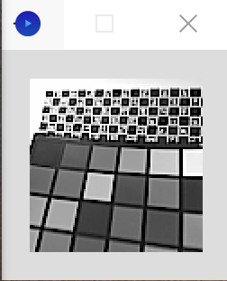

# Arducam Qwiic CAM Arduino Library

[](https://opensource.org/licenses/MIT)

Arduino library for Arducam Qwiic series camera modules, enabling rapid image capture and basic computer vision applications.

## Key Features

- Plug-and-play Qwiic I2C interface (no soldering required)
- Supports popular boards: Arduino UNO/Mega/Leonardo/ESP32 variants
- Programmable resolutions (96x96/128x128/320x240/320x320/640x480/1280x720/1600x1200)
- Programmable pixel format (RGB565 Y8 JPEG)
- Image buffering and real-time streaming capabilities

---

### Camera specs

<table>
  <thead>
    <tr>
      <th>Pixel Format</th>
      <th>Resolutions</th>
      <th>Image Type</th>
    </tr>
  </thead>
  <tbody>
    <tr>
      <td>JPEG</td>
      <td>96×96, 128×128, 320×240,<br>320×320, 640×480,<br>1280×720, 1600×1200</td>
      <td>Color</td>
    </tr>
    <tr>
      <td>RGB565</td>
      <td>96×96, 128×128</td>
      <td>Color</td>
    </tr>
    <tr>
      <td>Y8</td>
      <td>96×96, 128×128</td>
      <td>Gray</td>
    </tr>
  </tbody>
</table>

### Samples


| demo                              | function                                      |
| ----------------------------------- | ----------------------------------------------- |
| Example01_VideoStreamingWebServer | Capture image and send to webclient           |
| Example02_CaptureJPEG             | Capture JPEG image Shown by processing script |
| Example03_CaptureRGB              | Capture RGB image Shown by processing script  |
| Example04_CaptureY8               | Capture Y8 image Shown by processing script   |

## Hardware Requirements

- Arducam Qwiic CAM module
- Arduino-compatible board (UNO R4 WiFi is recommended)
- Qwiic cable or 4-pin I2C connector

## Getting Started

### Basic Wiring

```plaintext
Arduino        Qwiic CAM
3.3V  ------   VCC
GND   ------   GND
SDA   ------   SDA
SCL   ------   SCL
```

### Usage

1. Arduino IDE → *Sketch* → *Include Library* → *Manage Libraries...*
2. Search for "Arducam_Qwiic"
3. Install the latest version
4. Examples available under *File* → *Examples* → *Arducam_Qwiic*

### Sample image

<div style="display: flex; gap: 10px; align-items: flex-start;">
  
  
  
</div>
