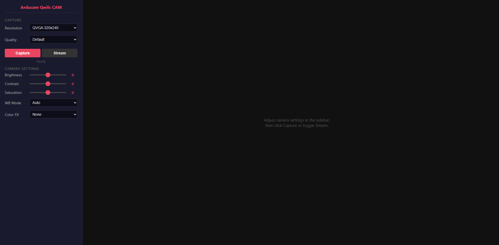

# CameraWebServer

A full-featured web-based camera control panel for the Arducam Qwiic CAM. Turns your Arduino into a WiFi access point with a responsive web UI for live preview and real-time camera parameter adjustment.

## Wiring

Connect the Qwiic CAM to your board via a Qwiic cable (I2C):

| Arduino  | Qwiic CAM |
|----------|-----------|
| 3.3V     | VCC       |
| GND      | GND       |
| SDA      | SDA       |
| SCL      | SCL       |

## Quick Start

1. Open `CameraWebServer.ino` in the Arduino IDE
2. Select your board and port
3. Upload the sketch
4. Open **Serial Monitor** (115200 baud) — wait for startup confirmation
5. Connect to WiFi AP `Arducam_Qwiic_CAM` (password: `123456789`)
6. Navigate to `http://192.168.4.1` in your browser

## Web Interface

The left sidebar provides live controls for all camera parameters:

| Control       | Range / Options                                                       |
|---------------|-----------------------------------------------------------------------|
| Resolution    | QVGA / VGA / HD / UXGA / FHD / WQXGA2 / 96×96 / 128×128 / 320×320   |
| Quality       | High / Default / Low                                                  |
| Brightness    | -4 ~ +4                                                               |
| Contrast      | -3 ~ +3                                                               |
| Saturation    | -3 ~ +3                                                               |
| White Balance | Auto / Sunny / Office / Cloudy / Home                                 |
| Color FX      | None / Bluish / Reddish / B&W / Sepia / Negative / Greenish / Over Exposure / Solarize |

Adjust any control and the preview updates in real time.

## Serial

Open the Serial Monitor (115200 baud) to view debug output and camera status messages during operation.

## Dependencies

- `Arducam_Qwiic_CAM` library (this library)

## Troubleshooting

- **Can't connect to AP?** Reset the board and check the Serial Monitor for the AP name.
- **Blank preview?** Ensure your device is connected to the camera's WiFi AP, not your local network.
- **Slow streaming?** Lower the resolution or quality from the sidebar.
